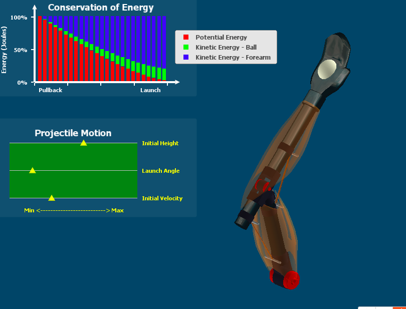
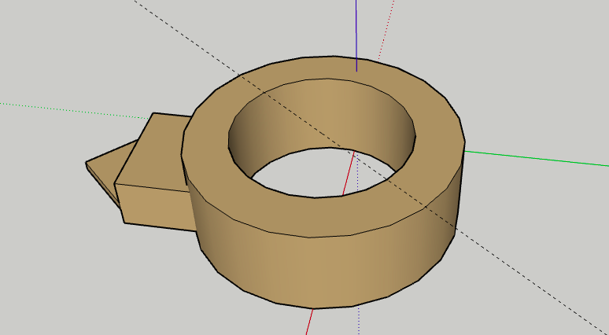
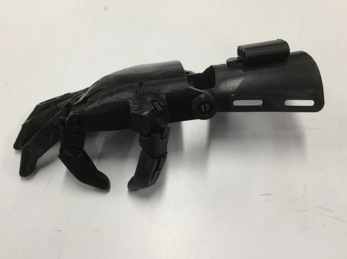
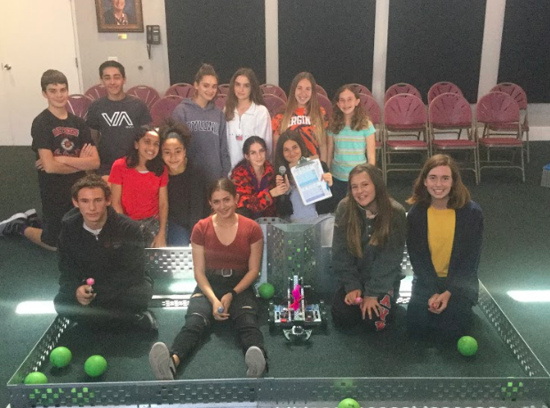

<!DOCTYPE html>
<html>
    
    <head>
    <meta charset="utf-8">
    <title>Technology Digital Portfolio</title>
    
    
    
    
    
    </head>
    
    
    
    <body>
        
        <h1>EngTechClass Project</h1>
        <h2>Lets get started!!!</h2>
        

        
        <h3>WhiteBox Learning (prosthetics)</h3>
            
        
In whitebox learning we made digital prosthetics, which we later made real life prototypes of are online prosthetics

        
        <ul>
            <li><a target="_blank"
                href= "https://www.whiteboxlearning.com/">Whitebox </a>
                </li>
                </ul>
        
     
        
        
       
    
        
    

    The photos above show our online hands on whitebox learning and the second shows some classmates working on prosthetics made from balsa wood.
    

    
    
    
        
           <h2> SketchUp 3D modeling</h2>
        
In sketchUp we designed and 3D printed attachments for Prosthetics

    <ul> 
    <li><a target="_blank"
           href="https://www.sketchup.com/?gclid=CjwKCAjw8-LnBRAyEiwA6eUMGhKUM2yWKdnkrgTvmZttMrrfSzLd50Z71eun2b6eLLcpEQYpVVn1YRoCepkQAvD_BwE"> SketchUp</a></li>
     </ul>
    
     
 

 
the first photo (above) shows my 3D design for my prostetic ring that is used to peel oranges. The second photo is a photo of a prosthetic hand

<h2>Vex Project</h2>

In vex we learned about robotics and got to program our own!

   

In the top 3 photos, the 1st one shows the coding used to code our robots. The 2nd photo is our class at our robot vex compettiton and the last photo is Lily and Isabel working on a robot

 
    
    
    <h2> Website Design Project</h2>
    
   
 During our website design project, we learned how to code using HTML and CSS codes!

    

   
    

    In the photo above, it shows the coding that was entiled for making a website such as this one
    

    
    
  
    
